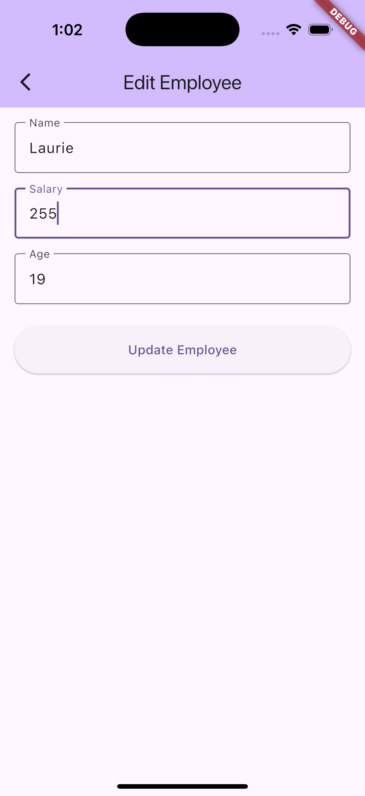

# app_http_dummydata

A new Flutter Full CRUD example project.

## Getting Started

This project is designed to show how to use at a simple level a full CRUD system.

It uses dummy data website to retrieve all employees but everything else is done in memory.   This is due to the timeouts of the dummy data website.

Employee List Page
Select Employee - Employee Details Page
Edit/Update Employee Details Form
Add Employee Form
Slidable Delete with Confirmation on Employee List Page.
Shows Scaffold Snackbar messaging.
Refresh button to ReFetch all Employees from Dummy Data website

###  Employee List

### Select Employee - Employee Details

### Edit Employee Details

### Add Employee

### Delete Employee

### Delete Alert Confirmation

